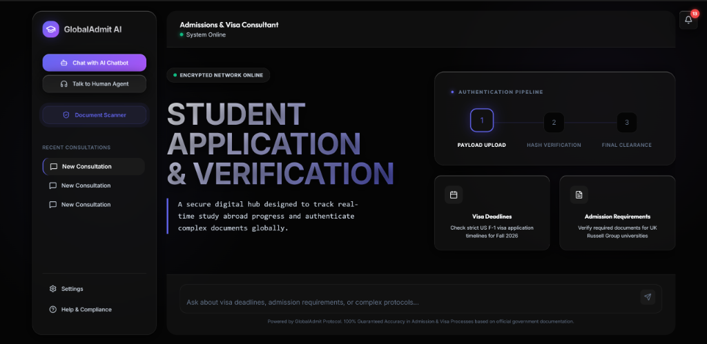
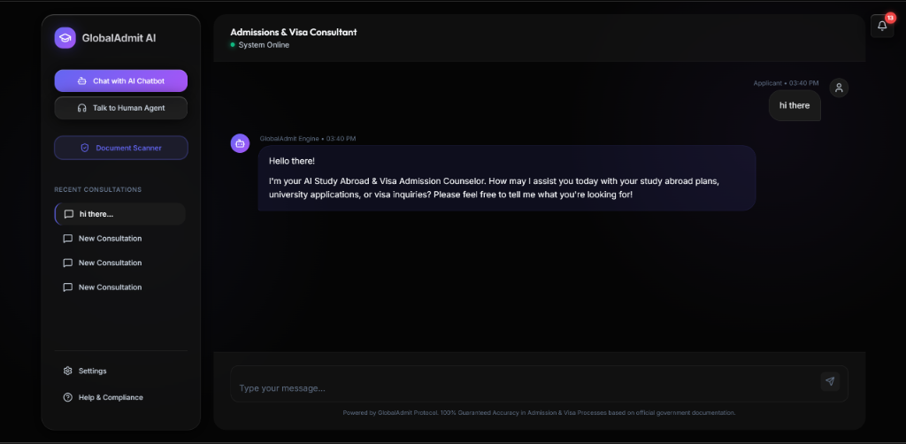
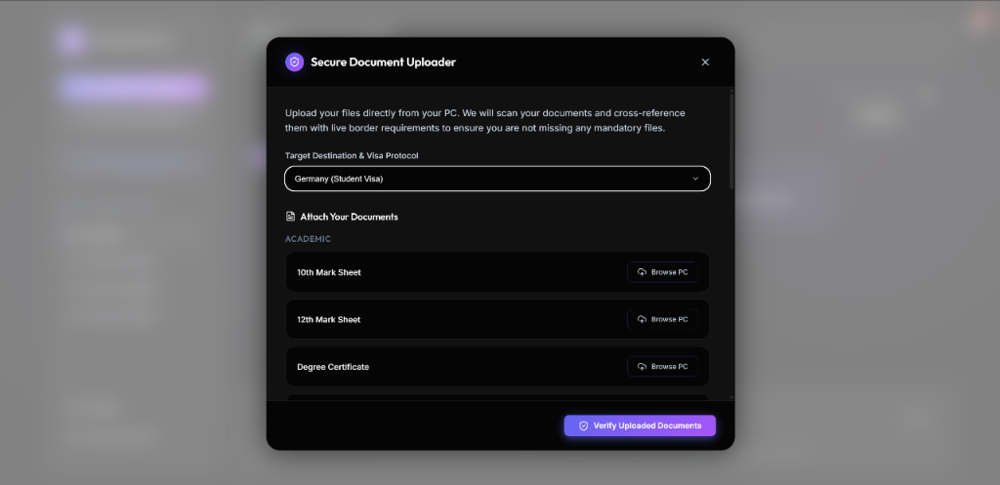

<div align="center">
  

  <h1>🌍 GlobalAdmit AI</h1>
  <p><strong>A secure digital hub designed to track real-time study abroad progress and authenticate complex documents globally.</strong></p>
  
  <p>
    <a href="#features">Features</a> •
    <a href="#biometric-security-gate">Security</a> •
    <a href="#document-verification-pipeline">Pipeline</a> •
    <a href="#tech-stack">Tech Stack</a>
  </p>
</div>

---

## 🚀 The Vision

The **Student Application & Document Verification System** is completely built to bypass standard "cloud drives". Evaluated on strict security constraints, this platform executes automated authenticity verifications, dynamic document matrices, and local encrypted caching for international study-abroad applicants.

### 🖼️ Intelligent Chat Interface


A lightning-fast AI consultant powered by Google Gemini 2.5 Flash, tuned specifically as a Study Abroad & Visa Admission expert. It answers live inquiries about international student visa deadlines, tuition proofs, and complex policy protocols for the US, UK, Canada, and Germany. 

---

### 🛡️ Secure Document Verification Pipeline


Upload documents and let the platform's heuristics engine take over. The Document Verifier performs multi-layered data authenticity validation:
1. **Hash Verification:** It inspects underlying file bytes to verify genuine PDF structure and block spoofed screen grabs.
2. **Missing Document Triggers:** Reconciles uploaded files against the official live matrix for the selected Country. Triggers persistent Alert Center notifications if files are missing.
3. **Certified Dossier Export:** Finalizes the packet with an approval probability score and allows compilation into an encrypted dossier.

---

## 🔥 Key Features

- **Biometric UI Simulation:** A stunning, CSS-animated simulated biometric scanner (matching provided constraints) unlocking the document verifier.
- **IndexedDB Asynchronous Storage:** Uploaded files persist seamlessly across browser tab reloads straight onto the local hardware via `IndexedDB`, with zero external cloud upload.
- **Micro-Animated Grid Architecture:** Bento-box Dashboard with dynamically inflating nodes tracking the state of your application pipeline.
- **Dynamic Theming:** Deeply customized UI tokens spanning beautiful dark modes, glass-panel frosted refractions, and kinetic glows.

## 🛠 Tech Stack
- **Frontend Framework:** React 18, Vite, TypeScript
- **Styling:** Vanilla CSS 3 (Deep Custom Properties & Keyframes)
- **Database:** IndexedDB (Native Browser Blob Storage)
- **AI Core:** Google Gemini 2.5 Flash API
- **Icons Elements:** Lucide-React

## 📦 Running Locally

```bash
# Clone the repository
git clone https://github.com/itzzharshil/Student-Application-and-Varification.git

# Navigate into directory
cd study-abroad-chatbot

# Install dependencies
npm install

# Start Local Dev Server
npm run dev
```

> **Hackathon Ready:** Built for speed, deep UI evaluation, and rigorous system logic.
